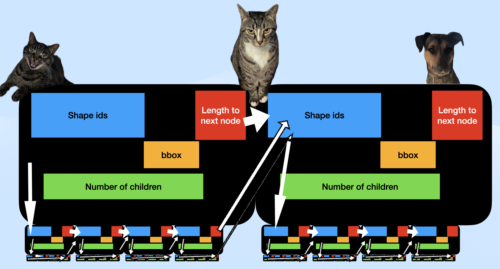
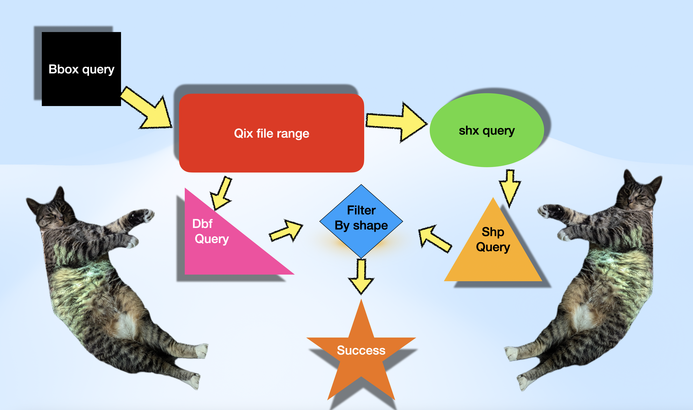

# Cloud-Optimized Shapefiles

Cloud-optimized shapefiles as a concept is a method of indexing shapefiles so that they can be queried efficiently via range requests.

## Shapefiles 

Shapefiles are a multi file format of 3 or more files that stores geometries and attributes seperately and includes an index to allow efficient retrieval of shape geometries by id.  As a format it is extendable by including additional sidecar files, common ones that have been added to plug gaps in the format include `prj` files to add projection support and `cpg` to add text encoding support. 

Shapefiles are an archaic format, the `shp` file used for geometry dating from the mid 1990s but the `dbf` file for attributes dating from the late 1970s.  Despite known issues such as 10 character limits to attribute names, the lack of ability to mix geometry types, and an ambiguous inner ring format; the format is the most well supported format, a charitably it could be described as a baseline that all clients can support, less charitably it is a cockroach that will outlive us all.

Out of the box shapefiles, as a format, support id and id range requests via range requests. To request a feature by id or features by range of ids require 2 requests to download the geometry and 1 request to download attributes plus 1 more on first request to download attribute headers.

The [`qix` sidecar](https://github.com/pramsey/mapserver/blob/main-coshp/coshp.md)  file format is an open format for adding rtree indexes developed as part of the mapserver project.  This file allows you to take a bounding box and derive a list of shape ids that possibly intersect that boundary. The qix node format is illistrated below.

The [COSHP tool](https://github.com/calvinmetcalf/coshp) allows for creation of `qix` files, reordering of shapefiles to better reflect `qix` index ordering.  By aligning shapefile ordering to qix file ordering it reduces the number of discrete range requests needed.

The COSHP library also includes a reference implementation for browser based querying based on the [idea from Paul Ramsey](https://blog.cleverelephant.ca/2022/04/coshp.html).  The process for querying is illustrated above.  
